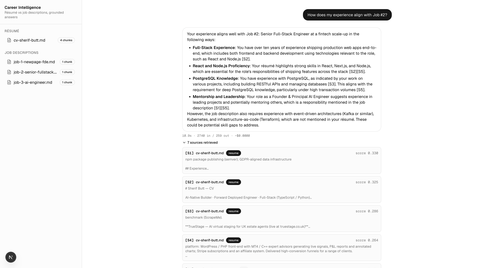
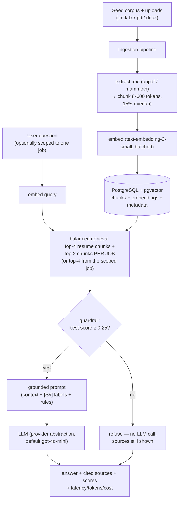
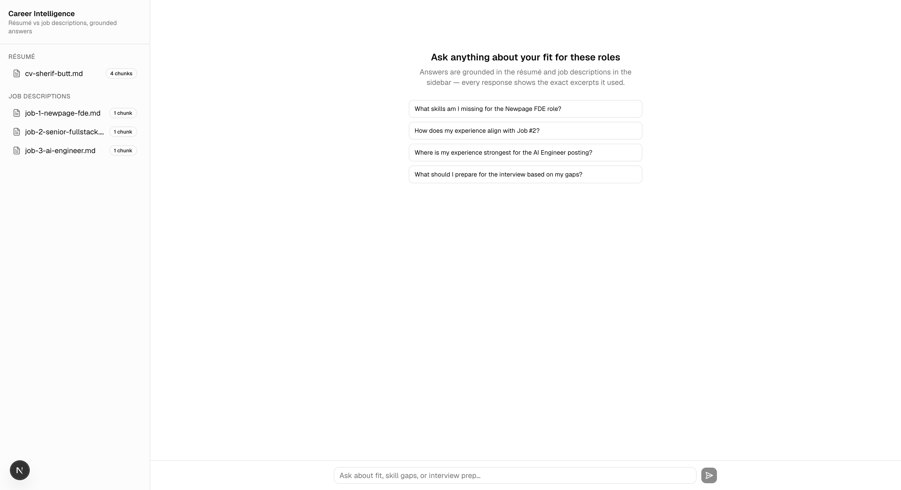
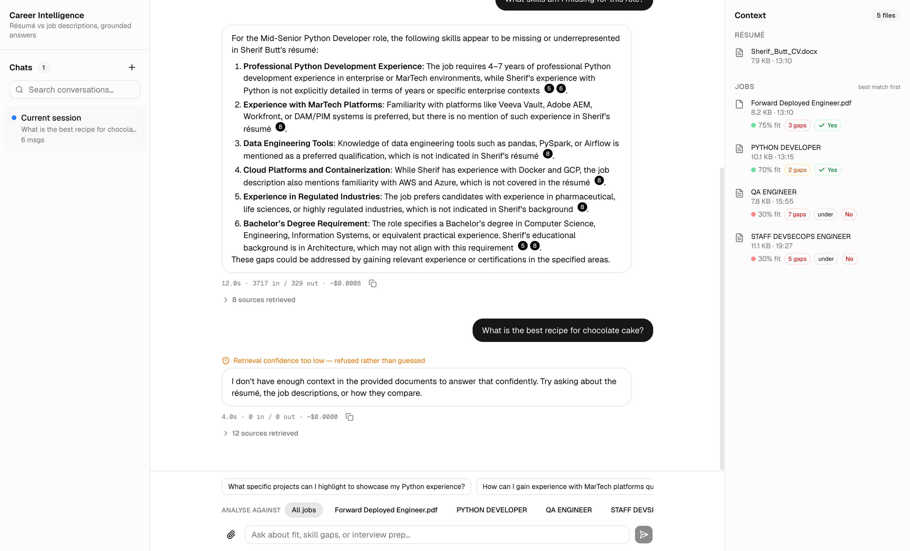
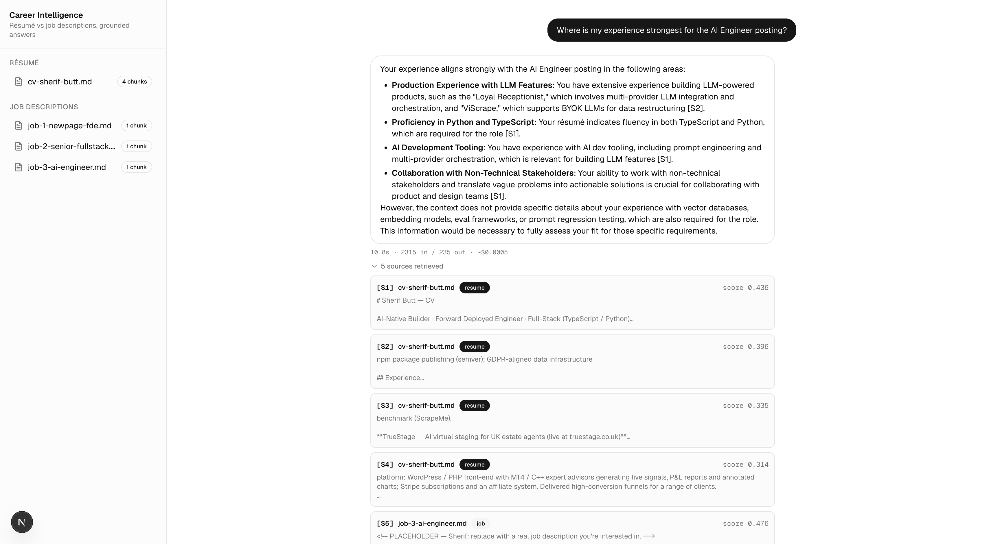
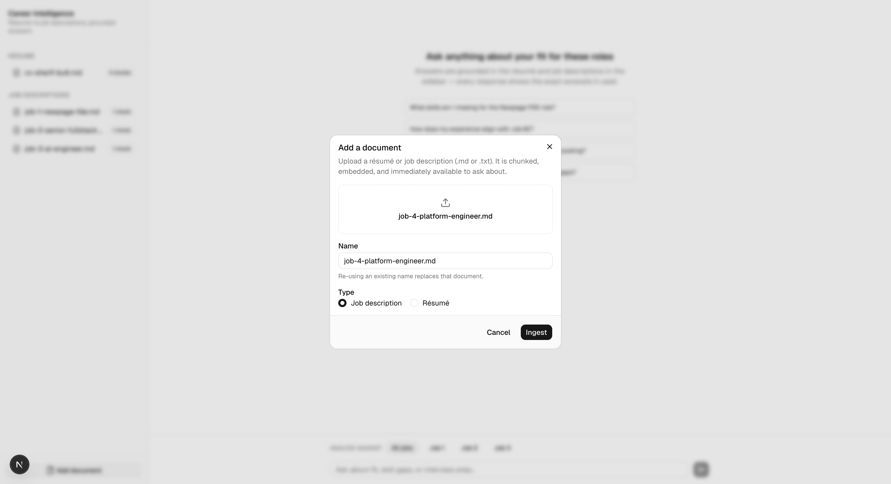
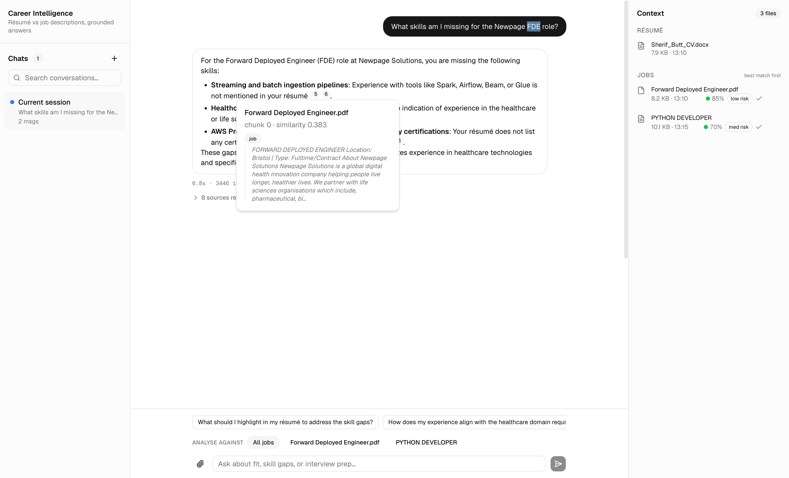
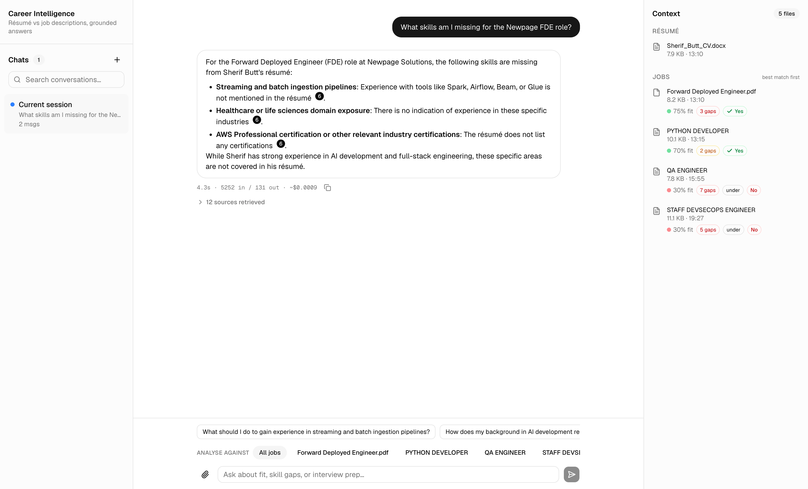

# Career Intelligence Assistant

A full-stack RAG application that analyses a résumé against multiple job descriptions and
answers grounded questions about fit, skill gaps, experience alignment, and interview prep —
with every answer showing the exact source excerpts and retrieval scores it used.

> **Note on AI use:** AI coding tools (Claude Code) were used to build this application and to
> produce a first-draft decision log. All reasoning and judgment in this README was reviewed,
> adjusted, and written by me; where I disagreed with the AI's draft, this document reflects
> my decision, not the model's.



## Quick setup

Prerequisites: Docker, Node 22+, pnpm, an OpenAI API key.

```bash
git clone <repo-url> && cd career-intelligence
cp .env.example .env          # add your OPENAI_API_KEY
docker compose up -d db       # postgres + pgvector (host port 5434)
pnpm install
pnpm seed                     # ingest /seed corpus: parse → chunk → embed → store
pnpm dev                      # app at http://localhost:3000
```

Or fully containerised (app + db):

```bash
docker compose up --build     # then: pnpm seed (against the running db)
```

Run tests:

```bash
pnpm test    # unit tests always run; retrieval integration tests
             # auto-skip without DATABASE_URL + OPENAI_API_KEY
```

## Architecture overview



The app is a single Next.js deployable: route handlers implement the API, the RAG pipeline is
hand-rolled in `src/lib/rag` (~300 lines), and PostgreSQL holds both relational data and
vectors. Each chat query is logged as one structured JSON line (`chat_query`) with query id,
retrieval scores, guardrail flag, latency, token usage, and estimated cost.

Key behaviours you can verify in the UI:

- **Corpus management** — the 📎 in the chat box uploads a résumé or job description
  (.md, .txt, .pdf, .docx — drag-and-drop or file picker). Text extraction runs server-side
  (unpdf for PDF, mammoth for docx); the document is chunked, embedded, and queryable
  immediately, with a scope chip appearing for each new job. Re-using a name replaces that
  document; hovering a document in the Context panel (right) reveals delete (with
  confirmation), which cascades to its chunks and falls the scope back to "All jobs" if
  needed. The Chats panel (left) is a visible placeholder — multi-conversation support is
  deliberately out of scope.
- **Multi-job awareness** — the job-side retrieval budget is allocated *per job* (top-2 chunks
  from each posting), so comparative questions cover every job instead of letting the most
  similar posting monopolise the context; answers spanning several jobs are organised per job.
- **Job scope selector** — an "Analyse against" control pins a question to a single posting
  (retrieval filters to that document), instead of relying on the question text happening to
  match a job's wording.
- **Contextual follow-ups** — after each answer, the quick-question row regenerates: a small
  LLM call (fired after the answer renders, so it adds no latency) predicts the four most
  useful next questions from the last exchange and the loaded documents. Falls back to the
  assignment's preset queries if generation fails.
- **Inline citations** — [S#] markers in answers render as numbered chips; hovering one shows
  the cited chunk (document, similarity score, and the excerpt itself) without leaving the
  answer. Adapted from the shadcn/AI-Elements inline-citation pattern.
- **Source transparency** — every answer also has a collapsible panel listing each retrieved
  chunk with its document, type badge, and similarity score.
- **Guardrail** — ask something off-topic ("chocolate cake recipe") and it refuses without
  spending LLM tokens, still showing the (low) scores that triggered the refusal.
- **Per-answer metrics** — latency, tokens in/out, and estimated cost under each response.

## Stack

| Concern       | Choice                                     | Note                                                    |
| ------------- | ------------------------------------------ | ------------------------------------------------------- |
| Framework     | Next.js (App Router) + TypeScript          | One deployable for FE + API                              |
| DB + vectors  | PostgreSQL + pgvector (HNSW, cosine)       | Relational + vector data in one transactional store      |
| ORM           | Drizzle                                    | Type-safe queries; schema mirrors `db/init.sql`          |
| Embeddings    | OpenAI `text-embedding-3-small`            | 1536 dims, batched                                       |
| LLM           | `gpt-4o-mini` via a provider abstraction   | Swappable via `LLM_PROVIDER` / `LLM_MODEL` env           |
| Orchestration | Hand-rolled pipeline (no framework)        | Chunk → embed → retrieve → prompt, all inspectable       |
| UI            | Tailwind CSS + shadcn/ui                   | Chat, sources panel, corpus sidebar, quick-query buttons |
| Containers    | Docker + docker-compose                    | `pgvector/pgvector:pg17` + app image                     |
| Tests         | Vitest                                     | Chunker, guardrail, retrieval-ranking integration        |

## Project structure

```
db/init.sql                  # schema + pgvector extension (runs on first db boot)
seed/                        # demo corpus: CV + 3 job descriptions
scripts/seed.ts              # pnpm seed — ingests /seed
src/lib/rag/                 # chunk.ts, embed.ts, retrieve.ts, prompt.ts, guardrail.ts, ingest.ts
src/lib/llm/                 # provider abstraction + OpenAI implementation
src/lib/observability/       # cost estimation + structured query logging
src/app/api/                 # /api/chat, /api/ingest, /api/documents
src/app/page.tsx             # chat UI
src/components/chat/         # sidebar + sources panel
tests/                       # retrieval integration test (self-skipping)
```

## Productionising on a hyperscaler

> ✍️ SHERIF — RE-VOICE THIS IN YOUR OWN WORDS.
> The reviewer requires YOUR thinking, not LLM text. Read entries **c1–c6** in
> docs/DECISIONS.draft.md, decide whether you actually agree (change it if you don't),
> then write this section from that. Owning the decision is what carries the interview.
> Prompts to cover:
>   - Which cloud and why — and does your answer differ for an enterprise customer vs your own product?
>   - How the single-container shape runs and scales (Cloud Run / ECS), and when ingestion moves to a worker.
>   - Managed Postgres + pgvector vs a dedicated vector DB — at what corpus size do you revisit?
>   - Secrets, CI/CD, and replacing init.sql with real migrations as a release step.
>   - Caching and cost controls — you already built budget caps into your MCP server; port that thinking.
>   - Offline eval pipeline + monitoring/alerting on the existing `chat_query` log line.

## RAG / LLM approach & decisions

> ✍️ SHERIF — RE-VOICE THIS IN YOUR OWN WORDS.
> Read entries **d1–d12** in docs/DECISIONS.draft.md, decide whether you actually agree
> (change it if you don't), then write this section from that.
> Prompts to cover:
>   - Chunking: why paragraph-first at ~600 tokens / 15% overlap; why a char heuristic over a tokenizer.
>   - Embedding model choice and what you'd use if data couldn't leave the customer's VPC.
>   - Why pgvector over Pinecone/Qdrant — two-sentence version you can say out loud.
>   - Why gpt-4o-mini, what a query costs (~$0.0006 observed), and what the provider abstraction buys.
>   - Why NO orchestration framework — and the threshold at which you'd reach for one.
>   - Job-aware retrieval (per-job budgets + the scope selector) instead of global top-k — the
>     strongest decision here and your product-innovation story; own both failure modes it fixes.
>   - Guardrails: how the 0.25 threshold was picked empirically and what its limits are.
>   - How you'd measure quality (golden set) and what the structured logs already give you.
>   - The second LLM call for follow-up suggestions (d10) — why decorative AI must fail invisibly.
>   - Inline citation chips (d11) — prompt-enforced markers, and the two-layer provenance story.

## Key technical decisions

> ✍️ SHERIF — RE-VOICE THIS IN YOUR OWN WORDS.
> Read entry **(e)** in docs/DECISIONS.draft.md — it lists six candidate forks
> (framework vs hand-rolled, pgvector, job-aware retrieval, guardrail-before-LLM,
> init.sql vs migrations, degradable secondary LLM calls). Pick YOUR top 3–4 and write
> the tradeoff you weighed at each.

## Engineering standards — followed & deliberately skipped

> ✍️ SHERIF — RE-VOICE THIS IN YOUR OWN WORDS.
> Read entry **(f)** in docs/DECISIONS.draft.md. Prompts to cover:
>   - What you held the line on (typing, why-comments, graceful failures, idempotent seed, commit story).
>   - What you skipped ON PURPOSE (auth, rate limiting, streaming, reranking, CI/CD, upload parsing)
>     and why each is the right call inside a ~4-hour timebox.
>   - Which skip you'd defend hardest as correct engineering, not just time pressure.

## How I used AI tools

> ✍️ SHERIF — RE-VOICE THIS IN YOUR OWN WORDS.
> Read entry **(g)** in docs/DECISIONS.draft.md — it contains the factual record
> (spec-first CLAUDE.md, phase commits, verification gates, what was delegated vs kept human,
> and four "AI/tooling was wrong" incidents — the docker exit-code lie is the strongest).
> Prompts to cover:
>   - Your workflow: spec file first, phase-boundary commits, typecheck/test/browser-verify gates.
>   - What you delegate vs what you never delegate (the reasoning in this README, for one).
>   - How you keep AI output to your standards and make the process repeatable.
>   - Your personal do's and don'ts with AI assistants.
>   - A concrete case where the AI was wrong and you caught it.

## What I'd do next

> ✍️ SHERIF — RE-VOICE THIS IN YOUR OWN WORDS.
> Read entry **(h)** in docs/DECISIONS.draft.md — the draft backlog (streaming, conversation
> memory, golden-set evals, section metadata, second provider, embedding cache, real
> migrations, multi-chat, OCR, suggestion-quality loop; upload and scope-routing are already
> done and struck through). Reorder to YOUR priority, cut what you wouldn't do, and say what
> you'd do differently from the start.

## Screenshots

| | |
|---|---|
|  |  |
|  |  |
|  |  |
|  | |

<!-- SHERIF: if time permits, record a short demo video and link it here. -->
