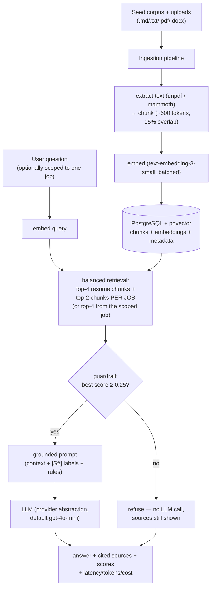
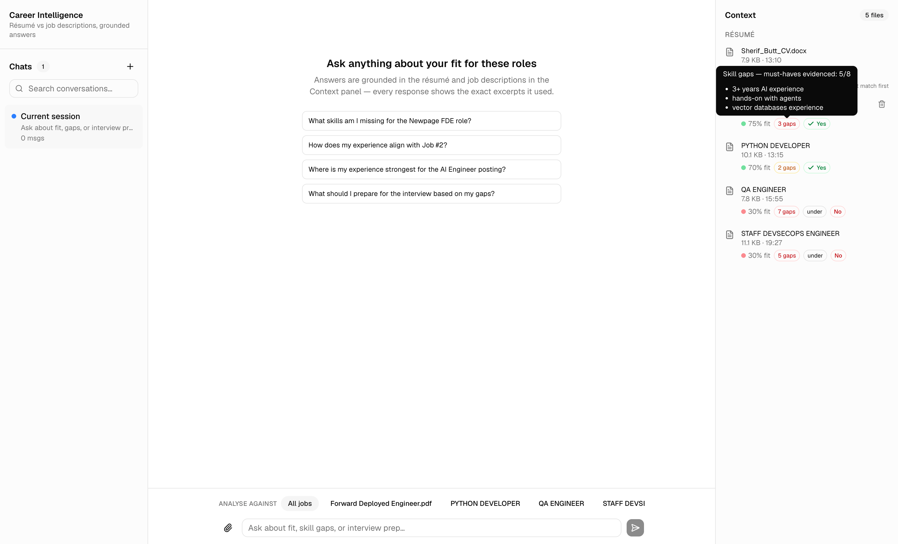
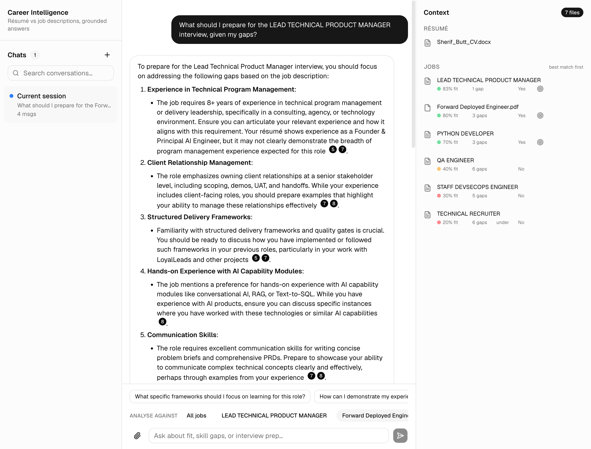

# Career Intelligence Assistant

A full-stack RAG application that analyses a résumé against multiple job descriptions and
answers grounded questions about fit, skill gaps, experience alignment, and interview prep —
with every answer showing the exact source excerpts and retrieval scores it used.

**▶ Demo (5 min)** — grounded Q&A with inline citations, live job upload + screening, the
guardrail refusing off-topic questions, one-click interview prep, and the structured
telemetry each query emits.

https://raw.githubusercontent.com/sherifButt/career-intelligence/main/docs/demo.mp4

> **Note on AI use:** AI coding tools (Claude Code) were used heavily to build this
> application, working phase-by-phase against a spec I wrote first (`docs/SPEC.md`). The
> write-up below was drafted with AI assistance from my decision log and then reviewed and
> edited by me — every decision described is one I made or challenged during the build, and
> the "How I used AI tools" section describes the workflow honestly, including where the
> tooling was wrong and how I caught it.


## Quick setup

Prerequisites: Docker, Node 22+, pnpm, an OpenAI API key.

```bash
git clone <repo-url> && cd career-intelligence
cp .env.example .env          # add your OPENAI_API_KEY
docker compose up -d db       # postgres + pgvector (host port 5434)
pnpm install
pnpm seed                     # ingest /seed corpus: parse → chunk → embed → store
pnpm dev                      # app at http://localhost:3000
```

Or fully containerised (app + db):

```bash
docker compose up --build     # then: pnpm seed (against the running db)
```

Run tests:

```bash
pnpm test    # unit tests always run; retrieval integration tests
             # auto-skip without DATABASE_URL + OPENAI_API_KEY
```

## Architecture overview



The app is a single Next.js deployable: route handlers implement the API, the RAG pipeline is
hand-rolled in `src/lib/rag` (~300 lines), and PostgreSQL holds both relational data and
vectors. Each chat query is logged as one structured JSON line (`chat_query`) with query id,
retrieval scores, guardrail flag, latency, token usage, and estimated cost.

Key behaviours you can verify in the UI:

- **Corpus management** — the 📎 in the chat box uploads a résumé or job description
  (.md, .txt, .pdf, .docx — drag-and-drop or file picker) or accepts pasted text/markdown
  directly. Text extraction runs server-side
  (unpdf for PDF, mammoth for docx); the document is chunked, embedded, and queryable
  immediately, with a scope chip appearing for each new job. Re-using a name replaces that
  document; hovering a document in the Context panel (right) reveals delete (with
  confirmation), which cascades to its chunks and falls the scope back to "All jobs" if
  needed. The Chats panel (left) is a visible placeholder — multi-conversation support is
  deliberately out of scope.
- **Multi-job awareness** — the job-side retrieval budget is allocated *per job* (top-2 chunks
  from each posting), so comparative questions cover every job instead of letting the most
  similar posting monopolise the context; answers spanning several jobs are organised per job.
- **Job scope selector** — an "Analyse against" control pins a question to a single posting
  (retrieval filters to that document), instead of relying on the question text happening to
  match a job's wording.
- **Job match screening** — every job gets a one-time recruiter-style LLM screen at ingest,
  surfaced in the assignment's own vocabulary: **fit** (0–100%, anchored rubric, median of 3
  samples for stability, judged by a stronger model than chat — `ANALYSIS_MODEL`, default
  gpt-4o — with today's date injected so date-range requirements compute correctly),
  **skill gaps** (count of unmet must-haves — hovering lists the
  actual missing skills as bullets), **experience alignment** (shown only as an under/over
  warning), and an **apply verdict** (Yes/No — is this application worth making as-is). The
  Context panel splits résumé from jobs and ranks jobs best-fit-first; re-ingesting the résumé
  re-screens every job; uploading a JD toasts its screen immediately.
- **One-click interview prep** — jobs with a Yes verdict get a 🎯 button that scopes the chat
  to that job and asks the interview-prep question through the normal RAG pipeline, so the
  prep advice arrives grounded and cited, and the follow-up suggestions continue the prep
  conversation. (Deliberately routed to chat instead of a separate dialog: one answer
  surface, zero new backend.)
- **Contextual follow-ups** — after each answer, the quick-question row regenerates: a small
  LLM call (fired after the answer renders, so it adds no latency) predicts the four most
  useful next questions from the last exchange and the loaded documents. Falls back to the
  assignment's preset queries if generation fails.
- **Inline citations** — [S#] markers in answers render as numbered chips; hovering one shows
  the cited chunk (document, similarity score, and the excerpt itself) without leaving the
  answer. Adapted from the shadcn/AI-Elements inline-citation pattern.
- **Source transparency** — every answer also has a collapsible panel listing each retrieved
  chunk with its document, type badge, and similarity score.
- **Guardrail** — ask something off-topic ("chocolate cake recipe") and it refuses without
  spending LLM tokens, still showing the (low) scores that triggered the refusal.
- **Per-answer metrics** — latency, tokens in/out, and estimated cost under each response.

## Stack

| Concern       | Choice                                     | Note                                                    |
| ------------- | ------------------------------------------ | ------------------------------------------------------- |
| Framework     | Next.js (App Router) + TypeScript          | One deployable for FE + API                              |
| DB + vectors  | PostgreSQL + pgvector (HNSW, cosine)       | Relational + vector data in one transactional store      |
| ORM           | Drizzle                                    | Type-safe queries; schema mirrors `db/init.sql`          |
| Embeddings    | OpenAI `text-embedding-3-small`            | 1536 dims, batched                                       |
| LLM           | `gpt-4o-mini` via a provider abstraction   | Swappable via `LLM_PROVIDER` / `LLM_MODEL` env           |
| Orchestration | Hand-rolled pipeline (no framework)        | Chunk → embed → retrieve → prompt, all inspectable       |
| UI            | Tailwind CSS + shadcn/ui                   | Chat, sources panel, corpus sidebar, quick-query buttons |
| Containers    | Docker + docker-compose                    | `pgvector/pgvector:pg17` + app image                     |
| Tests         | Vitest                                     | Chunker, guardrail, retrieval-ranking integration        |

## Project structure

```
db/init.sql                  # schema + pgvector extension (runs on first db boot)
seed/                        # demo corpus: CV + 3 job descriptions
scripts/seed.ts              # pnpm seed — ingests /seed
src/lib/rag/                 # chunk.ts, embed.ts, retrieve.ts, prompt.ts, guardrail.ts, ingest.ts
src/lib/llm/                 # provider abstraction + OpenAI implementation
src/lib/observability/       # cost estimation + structured query logging
src/app/api/                 # /api/chat, /api/ingest, /api/documents
src/app/page.tsx             # chat UI
src/components/chat/         # sidebar + sources panel
tests/                       # retrieval integration test (self-skipping)
```

## Productionising on a hyperscaler

I'd deploy this on GCP, mostly because that's where I have real production experience
(GaiaLens). The app is already a single stateless container, so the shape is simple:

- **Cloud Run** for the app. Scale-to-zero fits a low-traffic tool, instances are
  interchangeable because all state lives in Postgres. Cold starts are the price; fine here.
- **Cloud SQL with pgvector** for the database. It doesn't scale to zero, so it's the cost
  floor (~$10–30/mo). That's acceptable. AWS (ECS/Fargate + RDS) would be the equally valid
  enterprise answer — I'd pick whichever cloud the customer already lives in.
- **Secrets** in Secret Manager, injected as env vars. Never baked into images.
- **CI/CD** with GitHub Actions — build, test, push image, deploy. I run this pipeline on my
  open-source MCP server already; I'd copy it across. The `init.sql`-on-boot trick I used
  locally has to die in production and become drizzle migrations run as a release step.
- **Ingestion** moves to a queue/worker only when documents get big enough to prove it's
  needed. I wouldn't build that on day one.
- **Cost controls:** an embedding cache keyed by content hash (re-ingest becomes free), then
  daily budget caps and model routing. I built exactly this pattern (pre-call cost ledger,
  daily/weekly/monthly caps) into my MCP server, so I'd port it rather than invent it.
- **Monitoring:** the app already emits one structured JSON line per LLM call with scores,
  latency, tokens and cost. Production is just shipping those to Cloud Logging and alerting
  on p95 latency, error rate, guardrail-trigger rate, and daily spend. The logging seam was
  designed so nothing needs rewriting — only forwarding.
- **Offline evals** in CI before any prompt or parameter change (more under Quality below —
  I effectively already have the first golden set).

## RAG / LLM approach & decisions

**Chunking.** Paragraph-first packing at ~600 tokens with ~15% overlap, sentence-split
fallback for oversized paragraphs. Paragraphs are the natural unit of CVs and JDs (a role, a
requirements block), 600 tokens keeps a whole section intact, and the overlap protects facts
that straddle a boundary. I used a chars/4 heuristic instead of a tokenizer — chunk sizing
doesn't need tokenizer precision and it saves a dependency. Honest caveat: with documents
this small (the CV is 4 chunks) you could argue for no chunking at all; I kept it because
the retrieval discipline is the point of the exercise, and it has to survive bigger documents.

**Embeddings.** OpenAI `text-embedding-3-small`. Cheap ($0.02/1M tokens — this corpus embeds
for a fraction of a cent) and strong enough. If a customer required no-data-leaves-the-VPC,
I'd run a local BGE model; the cost is re-embedding everything when you switch, which is
trivial here and real at scale.

**Vector store.** pgvector, because I get relational data and vectors in one transactional
database — ingest is delete+reinsert in one transaction, no sync between two stores. A
dedicated vector DB is an extra service that buys nothing until somewhere around tens of
millions of vectors. I'd revisit at that scale, not before.

**LLMs.** Two models, deliberately. Chat uses `gpt-4o-mini` (~$0.0006 per grounded answer —
answering over pre-retrieved context is a small-model task). The job screening uses a
stronger model (`gpt-4o`) because it runs once per document and I learned the hard way that
the small model pattern-matches instead of reading evidence (details under Quality). Both sit
behind a small provider interface, so adding Anthropic is one file.

**No orchestration framework.** The pipeline is four function calls — chunk, embed, retrieve,
prompt — in ~300 lines I can read top to bottom. A framework would hide exactly the decisions
this project is about. I'd reach for LangChain/LlamaIndex when I need multi-step agent
orchestration or their tracing ecosystem, not for a linear RAG pipeline.

**Retrieval.** The most opinionated decision in the app. Every question here compares the
résumé against jobs, and a global top-k fails that in two ways: the query "my experience…"
is naturally closer to CV text so one side can dominate, and once JDs span multiple chunks
the most-similar posting monopolises all the job slots. So retrieval takes the top-4 résumé
chunks plus the top-2 chunks *per job* — every posting is always represented. The scope
selector then lets you pin a question to a single job, filtered server-side, instead of
hoping the phrasing happens to match the right document.

**Prompting.** One system prompt carrying the grounding contract: answer only from the
supplied excerpts, cite [S#] on every claim ("an uncited claim is a defect"), refuse when the
context doesn't cover the question. Each exchange is single-turn — conversation memory was a
scope cut, and it's the first UX feature I'd add back.

**Guardrails.** Hard guardrail before the LLM call: if the best retrieval score is under
0.25, refuse — costing $0 instead of producing a confident hallucination. The threshold is
empirical for this corpus (on-topic questions peak 0.3–0.6, off-topic under 0.2) and an
integration test pins that gap. Refusals still return their low scores so they're debuggable.
A fixed threshold is corpus-dependent; it's env-tunable for that reason.

**Quality controls.** This is where the project earned its scars, and I think the story is
worth more than any feature. The job-screening scores started out useless — every plausible
job got 85%. I caught it because my TypeScript-first CV scored the same 85 on an
"expert-level Python" role as on a role I genuinely fit. Fixing it took three rounds:

1. An anchored rubric (extract must-haves, judge each from résumé evidence, explicit score
   bands, hard rule on the primary skill) plus median-of-3 sampling at temperature 0, because
   single samples flip-flopped.
2. Two false gaps I challenged ("3+ years AI experience", "hands-on with agents" — both
   clearly on my CV) turned out to be different diseases: the model can't resolve
   "Oct 2019 – Present" without being told today's date (now injected), and the small model
   kept failing evidence-reading even with explicit instructions — a capability limit, so
   the screen got a stronger judge model. Prompt fixes are for instruction failures; model
   upgrades are for capability failures.
3. A manual audit of every screen against the documents found the rest: the reconstructed
   résumé was being truncated before judging (the model was failing evidence it never saw),
   and the "return only JSON" output format was suppressing the model's reasoning — asked to
   quote evidence per requirement it judged correctly; forced into bare JSON it
   pattern-matched. The screen now writes its evidence analysis first and emits JSON last,
   and the gap count is derived from the evidence list so the two can never disagree.

After the fixes the screens match my manual audit and the corpus spreads properly
(85 / 70 / 40 / 30 / 20 instead of everything-85). The audit's per-flag verdicts are a
ready-made golden set; wiring it into CI is top of my backlog. The general principle I took
away: when an LLM returns a number, make it show the evidence next to the number — that's
what let me catch every one of these.

**Observability.** One structured JSON log line per LLM operation — chat, suggestions,
screening — each with retrieval scores, latency, tokens and estimated cost. The same
telemetry is surfaced in the UI under every answer. Total cost of a full session is pennies,
and I can prove it.

## Key technical decisions

The forks I'd defend hardest:

1. **Hand-rolled pipeline over a framework.** Transparency over convenience. Every graded
   decision (chunk params, retrieval strategy, prompts, thresholds) is visible in plain code.
2. **pgvector over a dedicated vector DB.** One transactional store, one docker service,
   production-credible. Revisit at tens of millions of vectors.
3. **Per-job retrieval budgets over global top-k.** Domain knowledge (fit questions always
   compare two document types, across all jobs) encoded in ~10 lines. This one I'd call the
   product-thinking decision rather than an infrastructure one.
4. **Guardrail before the LLM call, not after.** Weak retrieval costs zero tokens and never
   produces a confident-sounding wrong answer.
5. **Decorative AI must fail invisibly.** The follow-up suggestions are a separate LLM call
   fired after the answer renders — it can never block or break the answer path, and it falls
   back to static presets on any failure.
6. **Schema in init.sql instead of migrations.** Right for a take-home (one idempotent file,
   zero moving parts), wrong for production — and it did bite me once when the schema grew a
   column and I had to ALTER a live database by hand. I'd say that trade was still correct
   for the timebox, but I know exactly where it stops being correct.

## Engineering standards — followed & deliberately skipped

**Held:** typed end-to-end with the RAG shapes in one module; small single-purpose functions;
comments explain *why* on every tuned parameter; graceful errors with actionable messages for
the failures that actually happen (missing key, DB down, empty corpus, oversized upload, LLM
failure); server-side enforcement of every limit the client checks; idempotent seeding;
one-command run; a commit history that tells the build story; tests aimed at the behaviours
that matter (chunker contract, guardrail, extraction against committed fixtures, live
retrieval ranking); every UI feature verified in a real browser before its commit.

**Skipped on purpose:** auth and multi-user (demo tool, no data boundary), rate limiting (no
public exposure), streaming responses (accepted the latency UX cost; the stop button covers
the worst of it), reranking (corpus too small to measure a benefit), CI/CD (the repo is the
deliverable, not a running service), OCR for scanned PDFs (text-layer PDFs and docx work;
image-only files are rejected with a clear message), multi-conversation chat (left as a
visible "coming soon" placeholder rather than a hidden gap).

The skip I'd defend hardest is streaming: it's the single biggest UX improvement available,
but it touches the provider abstraction, the route, and the client at once, and a working,
verifiable, non-streaming pipeline beat a half-finished streaming one inside the timebox.

## How I used AI tools

I built this with Claude Code, driving it the way I drive AI tools in my own products:
**spec first**. Before any code, I wrote a spec (now `docs/SPEC.md`) fixing the problem
choice, stack, architecture, phase plan, standards to hold, and standards to deliberately
skip. The assistant built phase by phase against it and had to surface deviations instead of
absorbing them. Every phase ended with typecheck + lint + tests + a real browser verification
before its commit. `docs/PROGRESS.md` is the log of what actually happened.

**What I delegated:** scaffolding, the pipeline implementation against parameters I set, UI
composition, test writing, screenshot capture, first-draft documentation.

**What I kept:** the problem choice, the stack, every tuned parameter sign-off, all product
decisions (which metrics to show, what vocabulary to use, where upload lives, dialog vs
chat-routing for interview prep), the quality challenges — and the judgments in this README.

Times the tooling was wrong and the process caught it:

- `docker compose build` **reported exit code 0 on a failed build** (a pnpm supply-chain
  policy inside the container rejected day-old lockfile entries). Only running the actual
  container exposed it. Lesson: verify the artifact, never the tool's exit code.
- Early on, moving the scaffolded app into the repo root overwrote my spec file with the
  generator's stub. It was recoverable only because I'd committed the spec before letting
  tools touch the tree. Commit the spec first, always.
- Vendored registry UI code arrived with props for the wrong primitive library and an unused
  carousel that failed this repo's lint. It got trimmed and adapted, not lint-suppressed —
  AI-generated and registry code passes the same bar as hand-written code or it doesn't ship.
- The screening quality saga above — where the fix was sometimes a prompt, sometimes a model,
  and twice a bug in what I was feeding the model. The discipline that caught all of it:
  make outputs inspectable, then actually inspect them.

My rules, short version: write the spec before the code; commit at every meaningful boundary;
let the AI produce volume, never conclusions; verify every feature in the running product;
and when an LLM gives you a judgment, demand the evidence next to it.

## What I'd do next

In priority order, honestly:

1. **Streaming responses** — biggest UX win, and it makes the stop button actually cancel
   server-side spend instead of just the client request.
2. **Golden-set eval in CI** — the manual audit already produced the eval set; a script away.
   No prompt or parameter change should land without it.
3. **Conversation memory** — follow-up questions are the natural interview-prep flow and
   single-turn is the most visible product gap.
4. **Section-aware chunk metadata** — headings on chunks ("cv › GaiaLens") for better
   citations and better retrieval. This is also my "differently from the start": it was cheap
   at ingestion time and pays off everywhere downstream.
5. **Second LLM provider** — prove the abstraction with Anthropic, add failover.
6. **Embedding cache + budget caps** — content-hash cache, daily spend ceiling (porting the
   ledger pattern from my MCP server).
7. **Real migrations** replacing init.sql for any deployed environment.
8. **Multi-conversation chat** — the left panel already reserves the space.
9. **OCR for scanned PDFs**, and logging which suggested questions get clicked — nearly-free
   eval data for the suggestion prompt.

## Screenshots

| | |
|---|---|
|  |  |
|  |  |
|  |  |
|  |  |
|  | |


